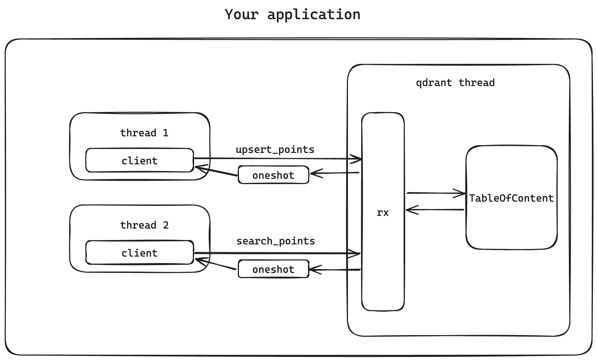

# Qdrant lib

## Disclaimer

This project is not suitable for production use. It has not undergone extensive testing, and the public interfaces are subject to change. If you are looking to incorporate a vector database into your Rust applications, please consider using [LanceDB](https://github.com/lancedb/lancedb).

## Why?

Qdrant is a vector search engine known for its speed, scalability, and user-friendliness. While it excels in its domain, it currently lacks a library interface for direct embedding into applications. This is fine for constructing a web service geared towards semantic search, as Qdrant can be used directly. However, for desktop or mobile applications, integrating a separate service is not an ideal approach. This library has been developed to address this specific challenge.

## What?

Qdrant offers both GRPC and RESTful APIs. This library is designed to mirror the functionality of Qdrant's RESTful APIs. As it is intended for embedding within applications, it supports only the following core APIs:

- [x] collections & aliases
- [x] points
- [x] search
- [x] recommend
- [ ] snapshot

However, the following service/cluster-related APIs will not be included in the supported features:

- cluster
- discovery
- shard

## How?

Qdrant's core architecture comprises components such as collection, memory, segment, and storage. The primary data structure we need to initialize is `TableOfContent`. Once we establish a method to create this structure, our next step is to integrate its functionality with the public-facing client APIs. However, since `TableOfContent` initiates multiple Tokio runtimes for indexing and searching, it cannot be operated directly under a standard `#[tokio::main]` application. To resolve this, we instantiate `TableOfContent` in a dedicated thread and facilitate communication through Tokio mpsc channels. All public-facing APIs function by internally dispatching messages to the dedicated thread and then awaiting the response.



Users can initiate a Qdrant instance in the following manner:

```rust
let client = QdrantInstance::start(None)?;
```

This process results in the creation of an `Arc<QdrantClient>`, which is based on the following data structure:

```rust
#[derive(Debug)]
pub struct QdrantClient {
    tx: ManuallyDrop<mpsc::Sender<QdrantMsg>>,
    terminated_rx: oneshot::Receiver<()>,
    #[allow(dead_code)]
    handle: JoinHandle<Result<(), QdrantError>>,
}
```

It's crucial to ensure that when the `QdrantClient` is disposed of, the `TableOfContent` is also appropriately dropped before the main thread terminates. To achieve this, we have implemented the Drop trait for `QdrantClient`:

```rust
impl Drop for QdrantClient {
    fn drop(&mut self) {
        // drop the tx channel to terminate the qdrant thread
        unsafe {
            ManuallyDrop::drop(&mut self.tx);
        }
        while let Err(TryRecvError::Empty) = self.terminated_rx.try_recv() {
            warn!("Waiting for qdrant to terminate");
            thread::sleep(std::time::Duration::from_millis(100));
        }
    }
}
```

This approach is designed to pause until a termination message is received from the thread maintaining the `TableOfContent`:

```rust
loop {
    match Arc::try_unwrap(toc_arc) {
        Ok(toc) => {
            drop(toc);
            if let Err(e) = terminated_tx.send(()) {
                warn!("Failed to send termination signal: {:?}", e);
            }
            break;
        }
        Err(toc) => {
            toc_arc = toc;
            warn!("Waiting for ToC to be gracefully dropped");
            thread::sleep(Duration::from_millis(300));
        }
    }
}
```

## How to use?

The library is currently in active development. To use it, simply add the following line to your `Cargo.toml` file:

```toml
qdrant-lib = { git = "https://github.com/tyrchen/qdrant-lib", tag = "v0.x.y" }
```

Then you could use it in your code:

```rust
let client = QdrantInstance::start(None)?;
let collection_name = "test_collection2";
match client
    .create_collection(collection_name, Default::default())
    .await
{
    Ok(v) => println!("Collection created: {:?}", v),
    Err(QdrantError::Storage(StorageError::BadInput { description })) => {
        println!("{description}");
    }
    Err(e) => panic!("Unexpected error: {:?}", e),
}

let collections = client.list_collections().await?;
println!("Collections: {:?}", collections);
```

For more detailed usage, refer to the [examples](./examples/) folder. It includes a straightforward example demonstrating how to index a Wikipedia dataset and perform searches on it.

## Future plan

- [ ] Provide a set of high-level APIs for common use cases
- [ ] Better documentation for the public APIs
- [ ] Add unit/integration tests
- [ ] Add performance benchmarks
- [ ] Add python bindings
- [ ] Add nodejs bindings

## Caveats

Currently, the library employs a modified version of the original Qdrant code. As a standalone library, minimizing unnecessary dependencies is crucial. However, the original Qdrant codebase includes several dependencies that are redundant for the library's purposes. For instance, the `collection` crate depends on `actix-web-validator`, which in turn introduces the entire `actix` ecosystem into the library. To circumvent this, we've eliminated the `actix-web-validator` dependency, opting instead to integrate the pertinent code directly into the collection crate ([code](https://github.com/tyrchen/qdrant/commit/9369c87d0743f2122d3129d4091ef0b9c29a1375)). While this is not an ideal solution, we plan to explore more optimal alternatives in the future.

Furthermore, we intend to remove certain dependencies, notably `axum` within the `api` crate, which was originally introduced by the `tonic` transport feature.

Update: Upon further review, we found that disabling the transport feature of `tonic` renders the `api` crate non-compilable. Additionally, crates like `collection` / `storage` are heavily dependent on the `api` crate. Therefore, we need to retain this feature for the time being.

## License

For information regarding the licensing, please refer to the [Qdrant License](https://github.com/qdrant/qdrant/blob/master/LICENSE) available on their GitHub repo. As of the current date, it is under the Apache 2.0 License.
